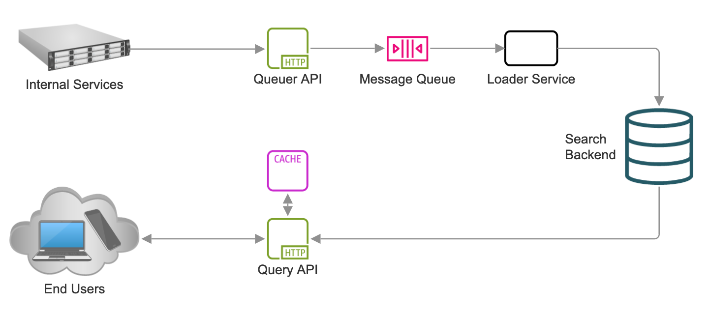

# Type-ahead Search for Wikipedia

This is a design for a system capable of providing type-ahead search
suggestions over Wikipedia.

This document was prepared by [Pete Gamache](mailto:pete@gamache.org)
in February 2024.

## Requirements

Acceptance criteria:

- [x] Single-word and phrase suggestion results
- [x] 10K requests per second minimum, with capacity to grow to 100K+
- [x] 50ms response time
- [x] 50M documents

Bonus criteria:

- [x] Streaming additions/updates/deletions
- [ ] Personalized relevance (discussed below)

## Overall Architecture



The type-ahead search system has four main components:

* The *Search Backend*, which is capable of indexing and deindexing documents,
  as well as answering type-ahead queries using this index.

* The *Queuer API*, an HTTP service which accepts requests to either index or
  deindex a particular Wikipedia page, and writes these requests to a message
  queue such as AWS Simple Queue Service.

* The *Loader Service*, which obtains work from the message queue, and
  executes the given index/deindex operation against the search backend.

* The *Query API*, which accepts HTTP requests for type-ahead suggestions and
  serves results from the search backend. This design includes an outboard
  cache for query results, typically something like Redis.

## Components

### Search Backend

This design suggests the use of ElasticSearch or similar, e.g., AWS
OpenSearch, as the search backend.

ElasticSearch, backed by Apache Lucene indexes, is a widely-understood
and battle-tested architecture for many kinds of document search, with wide
deployment as a type-ahead search engine capable of meeting or surpassing
all acceptance and bonus criteria for this project.

Both self-hosted and fully-managed ElasticSearch options are available,
and the architecture of ElasticSearch and Lucene allows for both vertical
and horizontal scaling of the search cluster. (This allows convenient
tuning of performance parameters via throwing money at the problem.)

Some key ElasticSearch concepts:

* One more more `index`es are supported, and one more more `document`s
  can be added to an index.
* Each document has a unique ID, which can be random or self-assigned.
* Within each index, a document can be updated or removed from the index
  using its ID.
* Many field data types are supported, each with different advantages.
  The most useful type for type-ahead search is `completion`, matched
  with the `suggest` search type. More info is available on the Elastic
  website:
  https://www.elastic.co/guide/en/elasticsearch/reference/7.17/search-suggesters.html#completion-suggester

### Queuer API

The Queuer API has a fairly simple task. It receives messages over HTTP, each
specifying a Wikipedia page URL and an action of either `index` or `deindex`.
It then posts these messages to a message queue that the Loader Service is 
consuming.

This could take a concrete form like the following requests:

```
curl http://queuer-api/ -H 'content-type: application/json' -X POST -d \
  '{"action": "index", "url": "https://en.wikipedia.org/wiki/Chaoshou"}' 
```
or

```
curl http://queuer-api/ -H 'content-type: application/json' -X POST -d \
  '{"action": "deindex", "url": "https://en.wikipedia.org/wiki/Xiaolongbao"}' 
```

The Queuer API can be horizontally scaled without a problem, but expected
resource usage is very low.

Access to this service should be protected by auth; only company-internal
sources should have the power to index or deindex documents.

#### Message Queue

Many message queue technologies can be used as a communication layer between
the Queuer API and the Loader Service. The features we are looking for are:

* Many workers can distribute work among themselves, evenly or unevenly
* Failed tasks can be retried at a later time by a different worker
* At-least-once delivery

On AWS, Simple Queue Service (SQS) fits the bill. It is cheap and extremely
reliable. (Side note: when an AWS service is commonly used as a building
block for other AWS services, you can assume it is absolutely rock-solid.
SQS, like EC2 and DynamoDB, falls into this category.)

### Loader Service

The Loader Service receives `index` and `deindex` operations over a message
queue. It performs some text processing, but its speed will likely be limited
to that of the Search Backend.

Loader Service can be scaled horizontally, but its performance relies heavily
on that of the Search Backend.

#### Indexing

For each `index` message, the Loader Service will:

* Retrieve the requested document from Wikipedia.
* Generate a unique ID based on the title or URL of the document by
  URL-encoding or Base64-encoding it, which allows quick and easy decoding
  on the query side.
* Process the document into an ordered list of lowercase words.
* Generate lists of two-word and three-word sequences (or more, if desired).
* PUT these lists into an index in the Search Backend.

(Note that other search backends may automate some of this process; the
implemention details here assume ElasticSearch.)

#### Deindexing

For each `deindex` message, the Loader Service will:

* Generate a unique ID based on the title or URL of the document.
* Delete this document from the search index.

### Query API

The Query API receives GET requests from searchbox users and returns an
appropriate list of type-ahead suggestions from the search backend.

The requests may look something like:

```
curl http://query-api/search?q=shum
```

And the results may look like:

```
{
  "results": [
    {
      "text": "shumai",
      "source": "https://en.wikipedia.org/wiki/Shumai"
    },
    {
      "text": "shumen",
      "source": "https://en.wikipedia.org/wiki/Shumen"
    },
    ...
  ]
}
```

Like the Queuer API and the Loader Service, the Query API can be scaled
horizontally without issue, but performance will be bound by that of the
Search Backend.

#### Caching

Caching at the query level is important, as it allows the Search Backend to
operate at a much lower cost. This design uses caching in two ways:

* Since the search queries are GET requests, traditional HTTP-layer caching
  using the `Cache-control` header is supported by all browsers.

* Internally, a cache such as Redis or Redis Cluster can be used to cache
  results from the Search Backend.

Each approach should be bounded by a reasonable time-to-live for each record.
This will make a huge improvement for popular search queries.

## Scaling, Sizing, and Deployment

The three custom pieces of software in this system, the Queuer API, Loader
Service, and Query API, are designed for horizontal scaling; none of the app
servers keep important state locally, and the units of work are small enough
that vertical scaling is not critical.

Many deployment strategies would be appropriate for these components;
Kubernetes or Amazon EKS, ECS, or EC2 with autoscaling are good choices.

Scaling the Search Backend is a larger task. This layer should be tuned under
test by applying an artificial load to simulate peak query volume, then
adjusting the cluster size, server configuration (RAM, CPU, etc), and/or
shards-per-index target to acceptable values.

The `completion` data type in ElasticSearch results in indexes that are stored
in-memory for speed, so RAM is a key concern for the search nodes. However,
the uncompressed corpus of Wikipedia is only around 100GB, which is broadly
achievable on modern server hardware; the index sizes will be of the same order
of magnitude. The best way to size the RAM needs of the cluster is to load
all of Wikipedia, which can be performed from a single ~20GB compressed XML
dump.

This project recommends the use of AWS OpenSearch as a managed
ElasticSearch service, due to the greatly reduced ops burden compared to
running ElasticSearch manually as a self-hosted service.

## A Note on Personalized Relevance

Personalized relevance is a big can of worms. There are many ways to do it,
lots of them are wildly inefficient, and all have the potential to degrade
the quality of non-personalized search rather than augmenting it.

Personal relevance requires tracking the identity of each searchbox user and
recording their search habits. This requires a fair amount of infrastructure
on its own. This information would be digested into a per-user search index,
which would be queried at the same time as the main index.

There are other approaches to improve search relevance which apply to the
entire user base:

* Popular search terms could be weighted more heavily in type-ahead results.
* Synonyms or related terms could be indexed and returned in type-ahead
  results alongside pure spelling-based entries.
* Search could be made to permit typographical errors (at the cost of increased
  index size and reduced query speed).
* Similar articles could be grouped by an unsupervised clustering algorithm
  such as Approximate Nearest Neighbor, and these associations could be used in
  search results via vector search.
 
In general, unless there were an immediately compelling use case for
personalization of type-ahead search results, this design advocates for
delivering a fully working non-personalized system before tackling
personalization.

## Other Details (Mostly) Omitted Here

* Auth
* Observability
* Age-out strategy
* Many tuning parameters
* Lots of things that will come to me five minutes after I submit this

## Thank You

Reviewing a design document takes a lot of time and effort. I appreciate
you all going out of your way to read this, I really do.

-Pete Gamache pete@gamache.org
